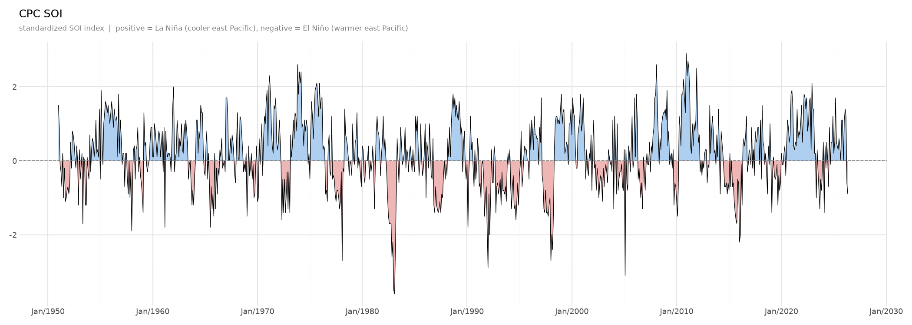

# SOI

Fetches, processes, and plots the SOI (Southern Oscillation Index) meteorological index from CPC.



## Usage

```bash
# first use
uv sync 

# fetch, parse and plot
uv run soi
```

Run again to pick up new monthly data. Only new rows are appended.

## Outputs

| Path | Description |
|---|---|
| `output/data/soi.csv` | Local cache |
| `output/charts/soi_timeseries.png` | Line chart with area fill |
| `output/charts/soi_heatmap.png` | Year × month heatmap |

## Development

```bash
uv run ruff check
uv run pyrefly
uv run pytest
```
